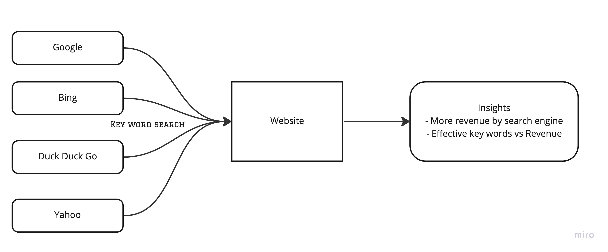

### Python Application to calculate search engine metrics.

### Pre-requisities

- Valid AWS account with access key and secret
- run aws configure to set up a profile "personal" with the account
- create .env directory with json "config.json" containing following details
    - "AWS_LAMBDA_ARN" - <ARN> for lambda
    - "AWS_ACCOUNT" - <AWS Account Id>,
    - "DEPLOY_BUCKET" - <Bucket for the deployment zip to reside>

### High level flow of the problem




### Local execution

Create virtual environment with python 3.9

```bash
python3.9 -m venv .venv

# check version of the virtual environment
.venv/bin/python --version

# run following command to activate
source .venv/bin/activate

# install requirements
pip install -r requirements.txt

```
to execute the code

```bash

python search_engine_metrics/lambda-handler.py <bucket path to input file>

```

to deactivate, type
```bash
deactivate
```

### Deployment

Make file is created to deploy the function easily in AWS as lambda function. Any dependencies should be specified in requirements.txt before the packge is deployed. 

```bash
make create-app
```

- Installs dependencies from requirements.txt 
- creates deployment package
- creates lambda function

```bash
make update-app
```

- Installs dependencies from requirements.txt 
- creates deployment package
- updates lambda function

### Known issues

- AWS wrangler is too large for lambda deployments
- Issues with adding environment variables
- Numpy - Python version conflict while running lambda